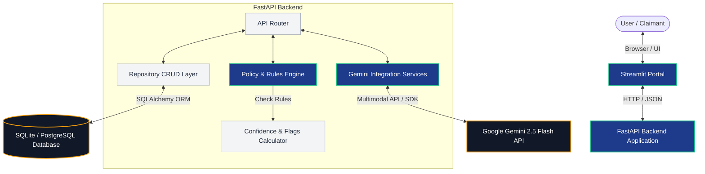
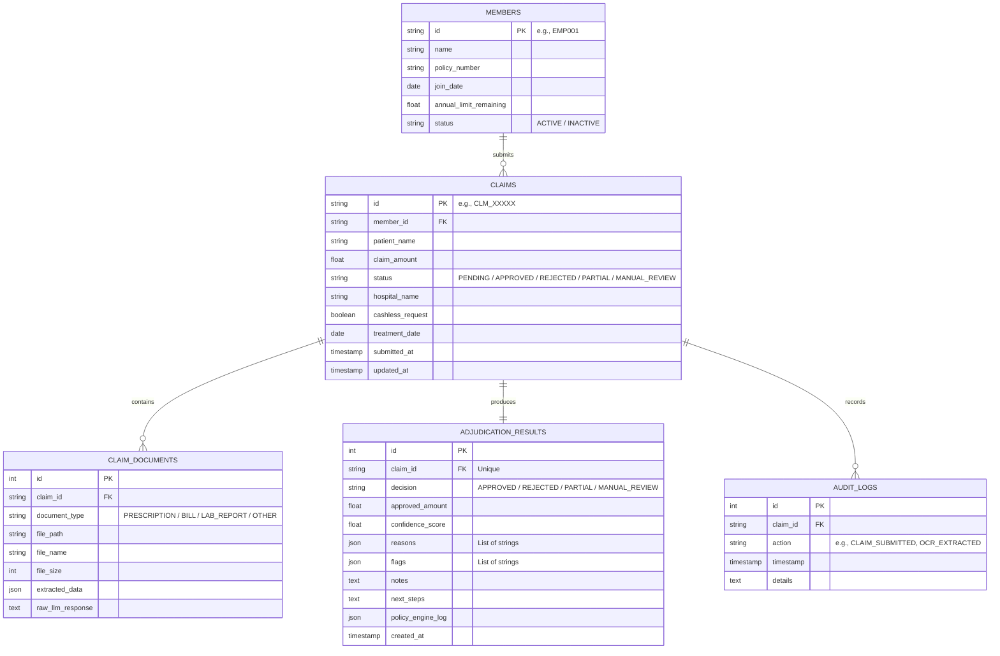
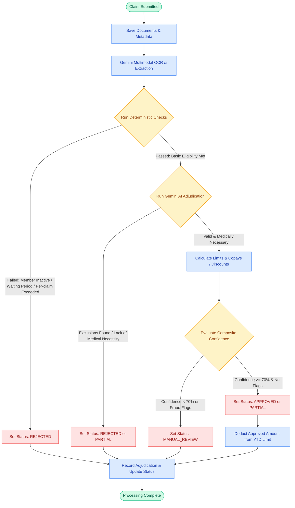

# Plum OPD Claim Adjudication Tool

An intelligent, multimodal claim adjudication system for OPD (Outpatient Department) insurance claims. It combines a deterministic policy rules engine with Google Gemini 2.5 Flash to automate document extraction, eligibility checks, and final claim decisions — surfacing only genuinely ambiguous cases to human reviewers.

---

## Table of Contents

- [System Architecture](#system-architecture)
- [Database Schema (ER Diagram)](#database-schema-er-diagram)
- [Claim Decision Flow](#claim-decision-flow)
- [Tech Stack](#tech-stack)

---

## System Architecture

The system is composed of three tiers: a Streamlit web portal for claimants, a FastAPI backend hosting the adjudication logic, and two external services — the Gemini 2.5 Flash API for multimodal AI and a relational database for persistence.

### Component Summary

| Component | Role |
|---|---|
| **Streamlit Portal** | Browser-based UI for claim submission and status tracking |
| **FastAPI Backend** | REST API gateway; orchestrates all backend services |
| **API Router** | Routes incoming requests to the appropriate service layer |
| **Repository (CRUD)** | SQLAlchemy-based data access layer for all DB operations |
| **Policy & Rules Engine** | Deterministic eligibility checks (waiting period, annual limit, member status) |
| **Confidence & Flags Calculator** | Computes composite confidence score; raises fraud/ambiguity flags |
| **Gemini Integration Services** | Handles OCR extraction and AI-based adjudication via Gemini SDK |
| **Gemini 2.5 Flash API** | Google's multimodal LLM — processes bills, prescriptions, lab reports |
| **Database** | Stores members, claims, documents, results, and audit logs |

---

## Database Schema (ER Diagram)

Five entities capture the full lifecycle of a claim — from member identity through document ingestion, adjudication result, and audit trail.

### Relationships

| Relationship | Cardinality | Description |
|---|---|---|
| `MEMBERS` → `CLAIMS` | One-to-many | A member can submit multiple claims |
| `CLAIMS` → `CLAIM_DOCUMENTS` | One-to-many | A claim can have multiple supporting documents |
| `CLAIMS` → `ADJUDICATION_RESULTS` | One-to-one | Each claim produces exactly one adjudication result |
| `CLAIMS` → `AUDIT_LOGS` | One-to-many | Every state change on a claim is logged |

---

## Claim Decision Flow

The adjudication engine processes each submitted claim through three sequential stages: deterministic eligibility checks, AI-powered medical necessity review, and a confidence threshold gate before final status assignment.

### Decision Stages

**Stage 1 — Deterministic Checks**
Hard policy rules evaluated before any AI call. A failure here results in an immediate rejection.

| Check | Fail Condition |
|---|---|
| Member status | Member is `INACTIVE` |
| Waiting period | Treatment date is within the policy's waiting window |
| Per-claim limit | Claimed amount exceeds the maximum allowable per single claim |

**Stage 2 — Gemini AI Adjudication**
Gemini 2.5 Flash reviews the extracted document data against policy exclusions and assesses medical necessity.

| Outcome | Description |
|---|---|
| `REJECTED` | Claim falls under a policy exclusion |
| `PARTIAL` | Partial medical necessity — only a portion of the claim is valid |
| Passes | Claim is valid and medically necessary → proceeds to limit calculation |

**Stage 3 — Confidence Gate**
A composite confidence score is computed from OCR quality, AI certainty, and policy match strength.

| Score | Fraud Flags | Final Status |
|---|---|---|
| ≥ 70% | None | `APPROVED` or `PARTIAL` |
| < 70% | Any | `MANUAL_REVIEW` |

---

## Tech Stack

| Layer | Technology |
|---|---|
| Frontend | Streamlit |
| Backend API | FastAPI (Python) |
| ORM | SQLAlchemy |
| Database | SQLite (dev) / PostgreSQL (prod) |
| AI / OCR | Google Gemini 2.5 Flash (multimodal) |
| Document types | Prescriptions, hospital bills, lab reports |
